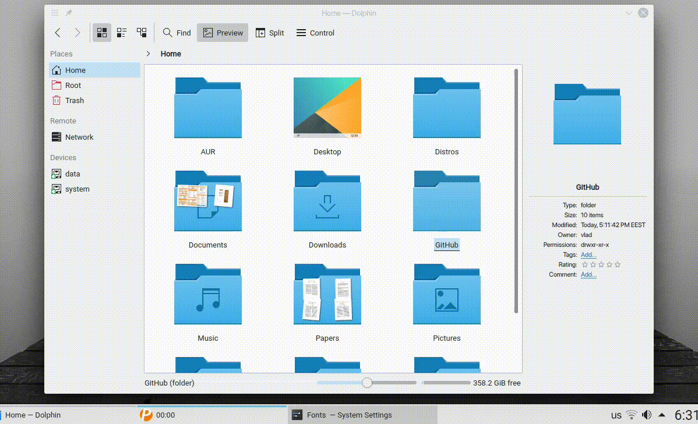

"Minimize 1" is a KWin effect that animates the minimizing of windows.

## Installation

### Arch Linux

For Arch Linux [kwin-effects-minimize1](https://aur.archlinux.org/packages/kwin-effects-minimize1/)
is available in the AUR.

### Ubuntu

```sh
sudo add-apt-repository ppa:vladzzag/kwin-effects
sudo apt install libkwin4-effect-minimize1
```

### From source

```sh
git clone https://github.com/zzag/kwin-effects-minimize1.git
cd kwin-effects-minimize1
mkdir build && cd build
cmake -DCMAKE_INSTALL_PREFIX=/usr ..
make -jN
sudo make install
```
